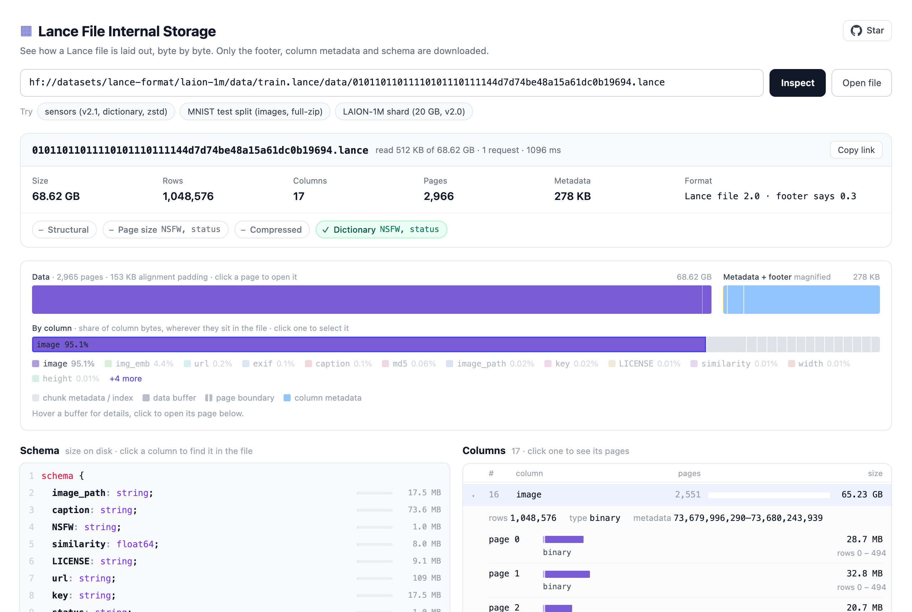

# Lance File Internal Storage

See how a [Lance](https://github.com/lance-format/lance) data file is laid out on disk: columns, pages, page buffers, encodings, column metadata, the schema and the footer.



Paste a Hub URL, an `hf://` path, any URL that allows CORS range requests, or open a local `.lance` file. Only the footer, column metadata and schema are downloaded, so a 20 GB file opens after reading 512 KB. Files written as Lance 2.0, 2.1, 2.2 and 2.3 are supported; legacy v0.x files are not.

To open files on S3, OCI Object Storage or NFS, run the included [server](server/README.md): it reads those locations with server-side credentials, serves the UI, and lets you browse a dataset directory to pick a data file.

This is a port of [Parquet X-ray](https://github.com/cfahlgren1/parquet-xray) to the Lance file format.

## Development

```sh
npm install
npm run dev       # http://localhost:5173/?url=sensors.lance
npm run verify    # lint, type-check, tests, build
```

See [CONTRIBUTING.md](CONTRIBUTING.md) for how the code is organized.

## License

[MIT](LICENSE). Portions are adapted from Parquet X-ray under the Apache License 2.0; see [NOTICE](NOTICE).
